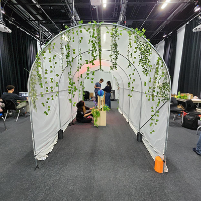
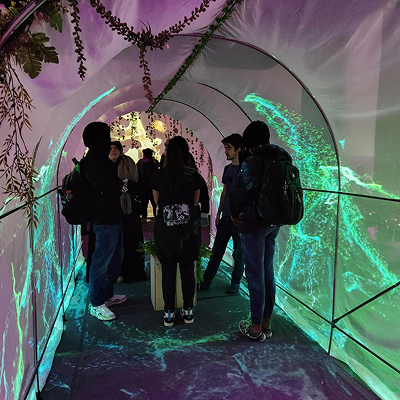
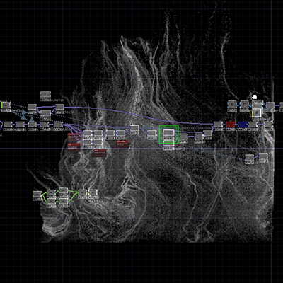
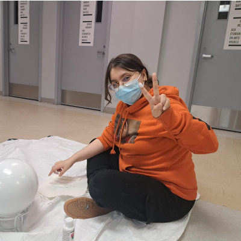
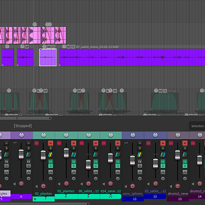
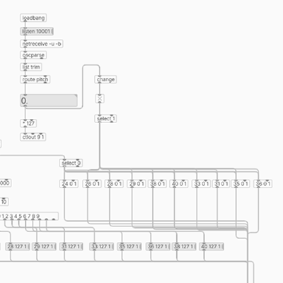
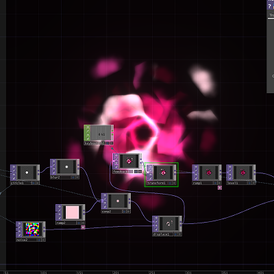
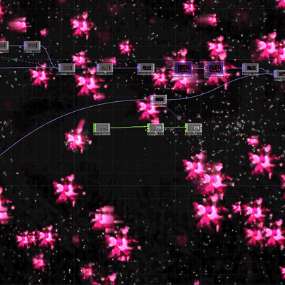
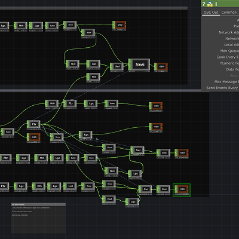

# Kenza El Harrif
 

 <!--   https://fakeimg.pl/400x400?text=Concept-->

 ## Réalisations

 <!-- Une image par semaine de la réalisation dont tu es le plus fier avec une légende -->

* 
* 
* 
* 
* 
* 
* 
* 
* 
* 
* 
* 
* 
* 
* 
* 
