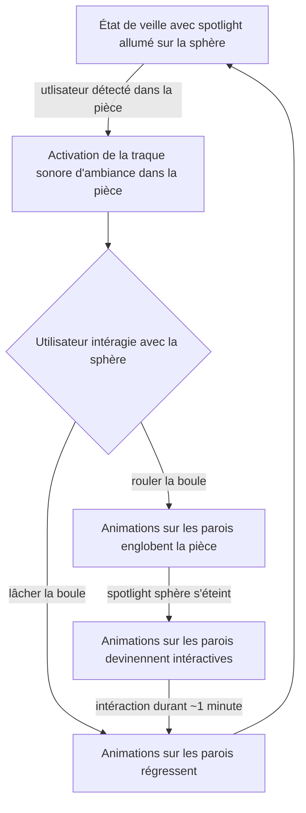
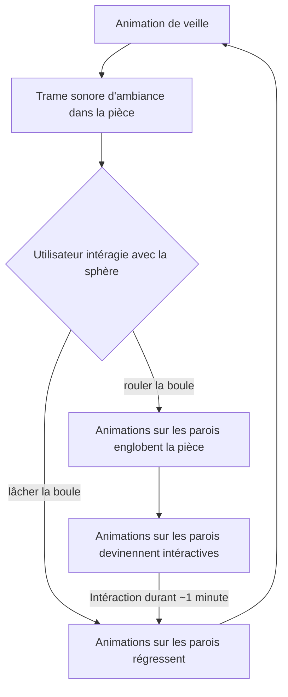

# Scénario

```mermaid
flowchart TD
    A[État de veille avec spotlight allumé sur la sphère] -->|utlisateur détecté dans la pièce| B[Activation de la traque sonore d'ambiance dans la pièce]
    B --> C{Utilisateur intéragie avec la sphère}
    C -->|rouler la boule| D[Animations sur les parois englobent la pièce]
    C -->|lâcher la boule| E[Animations sur les parois régressent] --> A
    D -->|spotlight sphère s'éteint| F[Animations sur les parois devinennent intéractives]
    F -->|intéraction durant ~1 minute| E
```

### Modification de scénario

```mermaid
flowchart TD
    A[Animation de veille] -->B[Trame sonore d'ambiance dans la pièce]
    B --> C{Utilisateur intéragie avec la sphère}
    C -->|rouler la boule| D[Animations sur les parois englobent la pièce]
    C -->|lâcher la boule| E[Animations sur les parois régressent] --> A
    D -->F[Animations sur les parois devinennent intéractives]
    F -->|Intéraction durant ~1 minute| E
```
