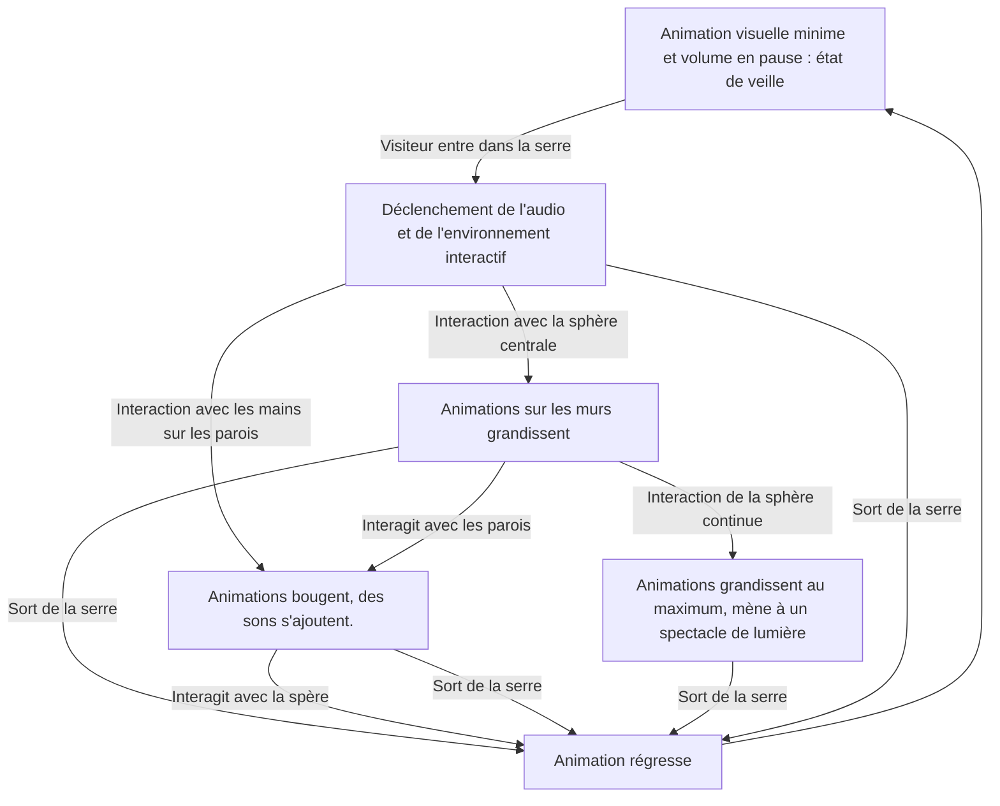

# Scénario

```mermaid
flowchart TD
A[Animation visuelle minime et volume en pause : état de veille] --> |Visiteur entre dans la serre| B[Déclenchement de l'audio et de l'environnement interactif]
B --> |Interaction avec la sphère centrale| C[Animations sur les murs grandissent]
B --> |Interaction avec les mains sur les parois| D[Animations bougent, des sons s'ajoutent.]
C --> |Interaction de la sphère continue| E[Animations grandissent au maximum, mène à un spectacle de lumière]
C --> |Interagit avec les parois| D
C --> |Sort de la serre| F
D --> |Interagit avec la spère| F
D --> |Sort de la serre| F
E --> |Sort de la serre| F
B --> |Sort de la serre| F[Animation régresse]
F --> A
```

## Références
