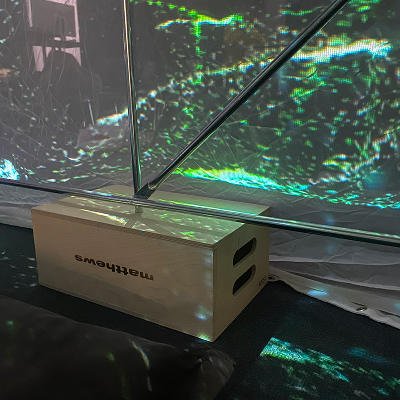
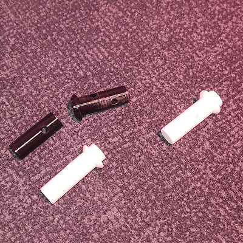
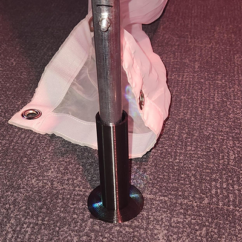

#  Étude de problématique par rapport au connecteur de la serre utilisé pour agrandir la serre verticalement

## Explication de la problématique
Nous utilisons une serre qui rend les bords petites. Nous avons besoin que la serre soit plus grande que ce que le produit de base offre.

## Études des solutions
###  Utilisation de boîte de pomme pour surélever la serre
Problématique: Les boîtes de pommes offre un visuel hors de l'expérance artistique du projet.

###  Utilisation de connecteur en 3D avec un tuyau d'aluminium similaire à celui de la serre
Problématique: La structure à perdu en solidité et les connecteurs ont tendance à se briser peut importe le remplissage de plastique des impressions.

###  Utilisation d'un tuteur pour prévenir les tuyau de plastique de se casser en deux par un accrochage accidentel de la serre
Problématique: Le tuteur à fait ses preuves et fonctionne! Mais il ne plait pas à nos supérieures qui désirent un stade de solidité supplémentaire.

###  Utilisation d'une barre d'acier intégrer dans le connecteur imprimé en 3D pour prévenir la séparation en cas de bris de la pièce
Sollution: Sa semble être l'alternative la plus adéquate pour assuré la meilleur solidité au projet possible.

