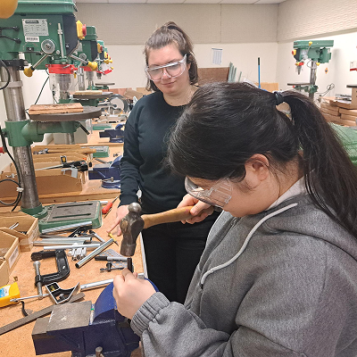
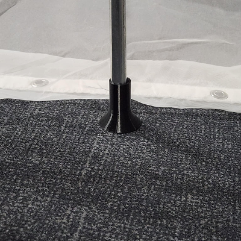
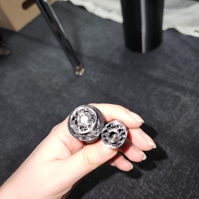
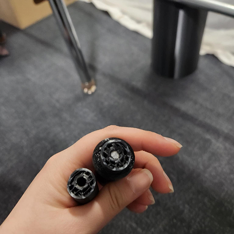
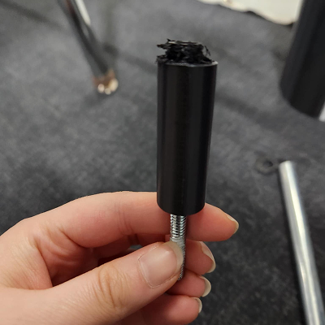
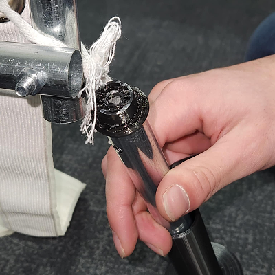
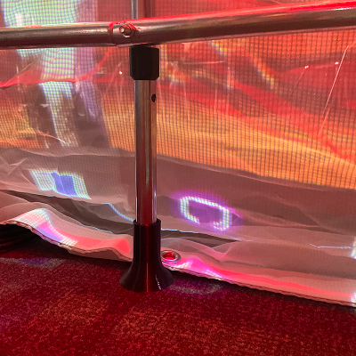
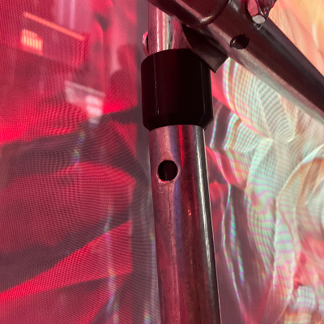
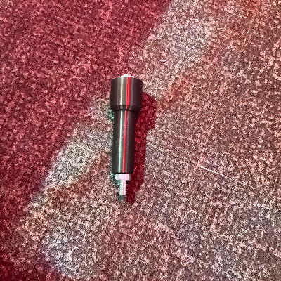

#  Étude de problématique par rapport au connecteur de la serre utilisé pour agrandir la serre verticalement

## Explication de la problématique
Nous utilisons une serre qui rend les bords petits. Nous avons besoin que la serre soit plus grande que ce que le produit de base offre.

## Études des solutions
###  Utilisation de boîte de pomme pour surélever la serre

**Problématique**: Les boîtes de pommes offre un visuel hors de l'expérance artistique du projet.

---

### Coupe des tuyaux et ajout de trous pour les vis

Nous avons coupés les tuyaux non utilisés pour la serre afin de créer des extensions. Nous avons rajoutés des trous pour les visser aux connecteurs et à la serre.

---

###  Utilisation de connecteur en 3D avec un tuyau d'aluminium similaire à celui de la serre

**Problématique**: La structure à perdu en solidité et les connecteurs ont tendance à se briser peut importe le remplissage de plastique des impressions.

---

###  Utilisation d'un tuteur pour prévenir les tuyau de plastique de se casser en deux par un accrochage accidentel de la serre

**Problématique**: Le tuteur à fait ses preuves et fonctionne! Mais l'angle droit au bas donne un risque de brisure ou de fragilité.

**Ajustement**: Nous avons fait une courbe à la place d'un angle droit pour moin de chances de brisure.

---

###  Utilisation d'une barre d'acier intégrer dans le connecteur imprimé en 3D pour prévenir la séparation en cas de bris de la pièce
**Solution**: Sa semble être l'alternative la plus adéquate pour assuré la meilleur solidité au projet possible.

**Problématique**: A fragilisé le connecteur en plastique au lieu de le solidifier

---

### Association de toutes les solutions trouvées pour intégrer les connecteurs
**Solution**: Créer un *socket* pour que le tuyau se stabilise autant à l'intérieure que à l'extérieur. Donc, on a mélangé plusieurs des techniques utilisées jusqu'à présent. Il y a un connecteur extérieur et intérieur auquel on ne va pas visser à la serre et auquel on y permet d'insérer une tige d'acier à la longueur complète. La gravité de la serre permet au tuyau de s'insérer dans le *socket*. Ainsi, le plastique ne se brise pas, et l'extérieur empêche la pate de glisser. En rajoutant le tuteur, on rajoute une stabilité complète. Pour l'instant, on garde l'oeil afin de s'assurer que tout reste en place et reste stable. À suivre.

