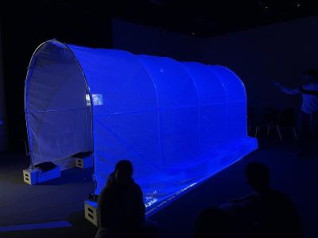
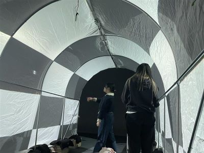
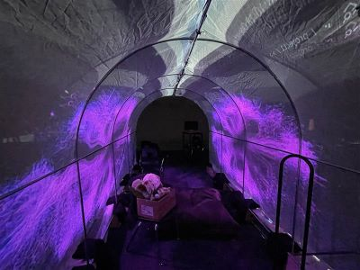
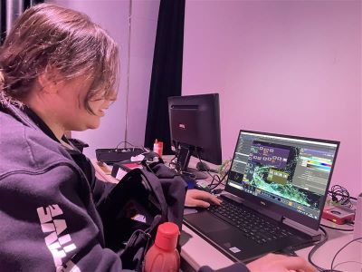
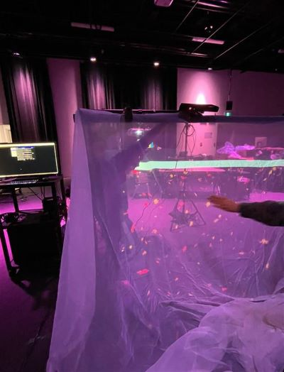

# Maquette

Pour la maquette, nous voulions nous assurer que les principaux éléments de notre œuvre soient recréés à une échelle plus petite. Il était important de tester ces éléments pour la suite du projet et de savoir dans quelle direction nous allions.

### La sphère interactive et son piédestal 
Nous avions conçu la maquette du piédestal dès la première semaine pour nous assurer qu'il était possible de détecter les informations d'une sphère qui bouge dans toutes les directions. Avec des retailles de bois, de vieux roulements à billes et une souris d'ordinateur à peine fixée, notre maquette fonctionnait à titre de test. Bien sûr, le roulement de la sphère était un peu difficile, mais autrement, tout fonctionnait comme nous l'avions imaginé.

### Les vignes grimpantes 
Dans TouchDesigner, il était important de trouver comment utiliser les données de la boule et les appliquer pour rendre l'expérience agréable. Nous avons effectué plusieurs tests pour recréer notre vision. Notre première version des vignes ne fonctionnait pas, car au lieu de grimper, elles s'étiraient. Finalement, elles ont bien servi à visualiser le reste du projet.

### L'agrandissement de la serre en hauteur
La serre était suffisamment haute pour permettre de se déplacer sans problème, mais nous nous sentions tout de même un peu coincé. Nous avons donc décidé de surélever la serre en la plaçant sur des boîtes de pommes. Nous avons réalisé que c'était la hauteur parfaite. Pour la maquette, nous avons gardé les boîtes de pommes, mais nous savions dès le départ que nous devions trouver quelque chose de plus différent et plus sécurisé. L'impression 3D nous a bien aidés pour la suite des choses.

## Gallerie d'images

* 
* 
* 
* 
* 

## Vidéo du la maquette en action

## Références 

* [Étude de faisabilité](https://tim-montmorency.com/582523-gestion/#/contenus/4_faisabilite/10_etude/)
* [Maquette](https://tim-montmorency.com/582523-gestion/#/contenus/4_faisabilite/30_maquette/)

