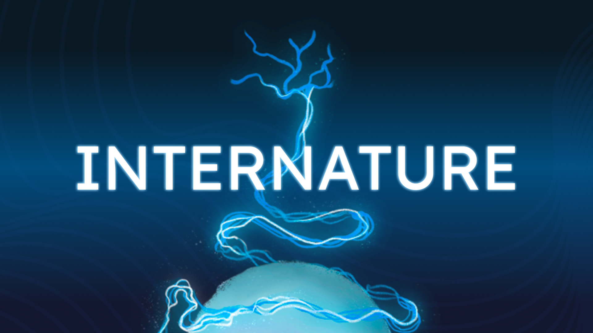

<a style="display: flex; justify-content: space-around">Vidéo d'intention</a>

 
 
Internature est un tunnel immersif qui intègre le mapping vidéo interactif sur ses parois accompagné d'une musique ambiante et des bruitages afin de vraiment submerger l'utilisateur dans un environnement de nature synthétique. Au cœur de cet environnement, l’utilisateur est invité à interagir avec une boule pour embellir l'environnement, déclenchant finalement un spectacle de lumière dynamique intéractif au toucher et l’amenant à réfléchir sur l’impact de l’être humain sur celle-ci.

## Bande-annonce

## Documentation installation

## Gallerie image

* 
* 
* 
* 
* 
* 

